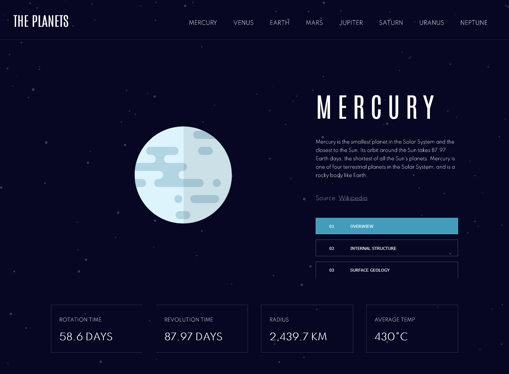

# Frontend Mentor - Planets fact site solution

This is a solution to the [Planets fact site challenge on Frontend Mentor](https://www.frontendmentor.io/challenges/planets-fact-site-gazqN8w_f).

## Table of contents

- [Overview](#overview)
  - [The challenge](#the-challenge)
  - [Screenshot](#screenshot)
  - [Links](#links)
- [My process](#my-process)
  - [Built with](#built-with)
  - [Continued development](#continued-development)
- [Author](#author)

## Overview

### The challenge

Users should be able to:

- View the optimal layout for the app depending on their device's screen size
- See hover states for all interactive elements on the page
- View each planet page and toggle between "Overview", "Internal Structure", and "Surface Geology"

### Screenshot

### Links

- Live Site URL: [Planet App](https://planets-app.vercel.app/)

## My process

### Built with

- Semantic HTML5 markup
- Flexbox
- Desktop-first workflow
- [React-router DOM](https://reactrouter.com/)
- [React](https://reactjs.org/) - JS library
- [CSS-in-Js (JSS)](https://cssinjs.org/?v=v10.7.1) - For styles

### Continued development

During this challenge I've realised I need to focus more in understanding how to use React's costum hooks in more efficiently.

## Author

- Website - [Ilaria Callegari](https://www.ilariacallegari.com)
- Github - [@ilariacallegari](https://github.com/IlariaCallegari)
